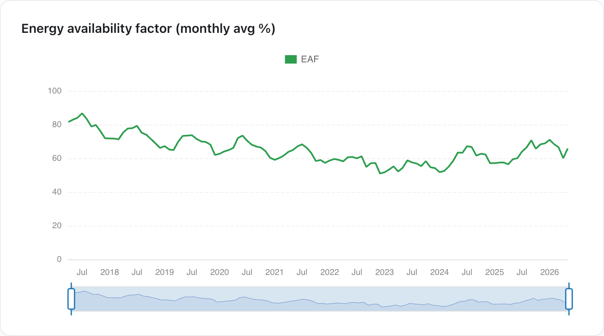
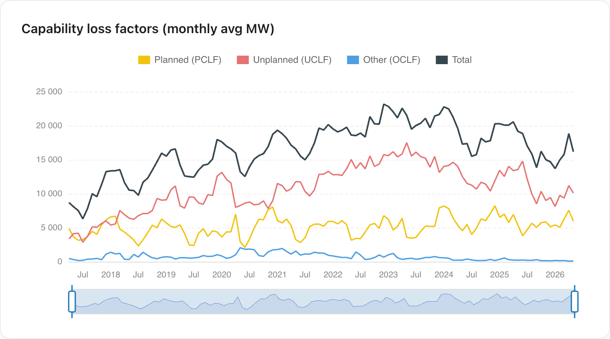
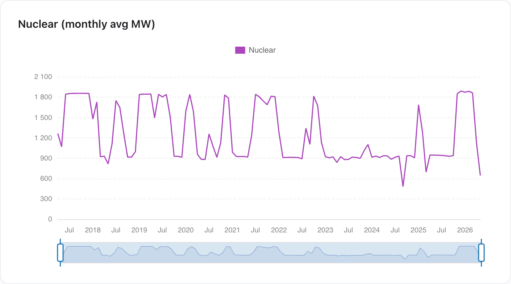
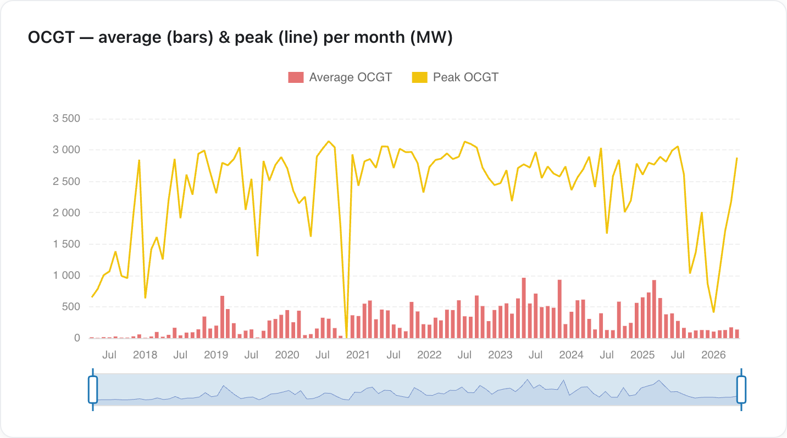
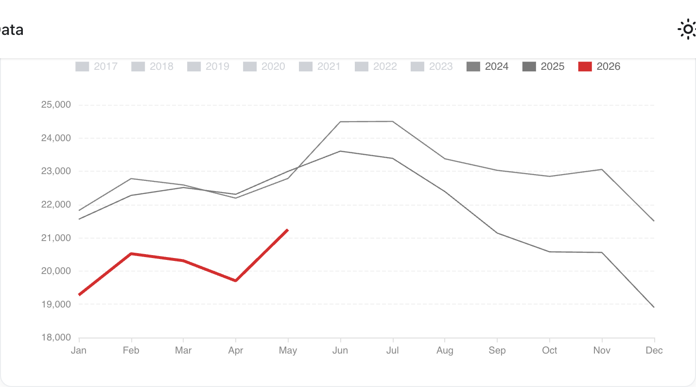
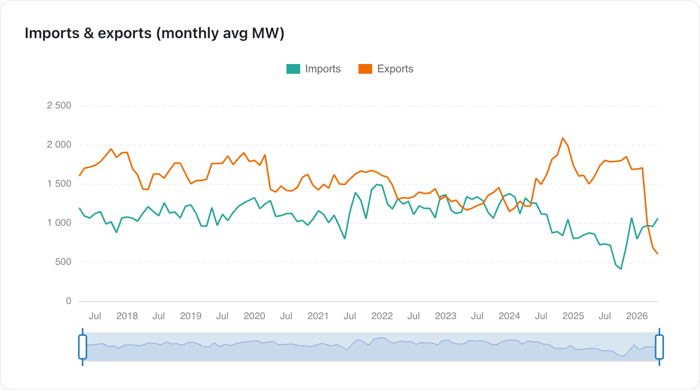
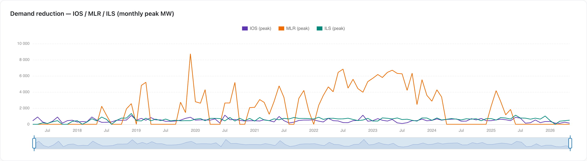

After April's wobble, May 2026 looks like a partial recovery on paper — but it's a shallow one, propped up by a still-broken Koeberg and the lowest May demand on record.

May 2026 saw:

- **EAF recover to 65.8%** (from 60.1% in April), but still below January–March
- **Nuclear output get *worse*** — averaging just 645 MW, with Koeberg running a unit at reduced capacity for a whole month
- **A one-day OCGT peak of 2.9 GW**, the highest in months — though average use stayed minimal
- **Demand fall to 21,249 MW — the lowest May on record**, below even Covid-2020

{/* truncate */}

---

## Outages eased — mostly seasonally

The headline number recovered: the Energy Availability Factor rose from April's 60.1% to **65.8%**, and total outages fell from 39.9% to **34.2%** of fleet capacity. Most of that is the expected seasonal swing — planned maintenance (PCLF) was pulled back from 16.0% to **12.6%** as Eskom clears the decks for winter peak demand. Unplanned outages (UCLF) also eased, from 23.7% to **21.4%**, though they remain elevated.

Year-on-year it's genuinely better: May 2025 sat at 59.4% EAF, so the fleet is ~6 points more available than a year ago.

*EAF recovered to 65.8% in May after April's dip, but remains below the 70%+ of January.*

*Total outages (black) eased back to ~15 GW as planned maintenance (yellow) wound down for winter; unplanned (red) remains elevated.*

---

## Koeberg still broken

The one metric that got *worse* in May is the one Eskom has said least about. Nuclear output averaged just **645 MW** for the month — down from 1,132 MW in April and 946 MW in May 2025. To be clear, this isn't a unit being taken fully offline: Koeberg has been running **one unit at reduced capacity for the entire month**, the same problem flagged in April, and Eskom still hasn't said a word about it. A whole month of a flagship nuclear station limping along with no public explanation is not normal.

*Nuclear output drops off a cliff at the right edge and stays there through May — one unit running well below its ~900 MW rating, all month.*

---

## OCGT: a one-day spike, not a trend

Average OCGT (diesel turbine) use stayed genuinely low for May at **137 MW**. The headline is the monthly *peak* of **2,879 MW** — the highest in months and up from April's 2,180 MW — but that was essentially a **single day's** burst, not a sustained ramp. It's worth flagging because it's the most expensive plant in the fleet and diesel is in short supply, but on its own one peak day isn't yet a winter trend; it's a reminder of how quickly the fleet leans on diesel when something slips.

*Average OCGT use (red bars) is barely visible, while the monthly peak (yellow line) jumps to ~2.9 GW — driven by one day.*

---

## Demand at a record low

The recovery is only possible because demand keeps falling. Average residual demand in May was **21,249 MW** — the lowest May figure in the record, below even May 2020 (22,437 MW) when Covid shut the country down, and down ~8% on May 2025.

The "surplus" remains as much a demand-collapse story as a generation one: rooftop solar growth, industrial load curtailment, and a weak economy are doing a lot of the work that the generation fleet is being credited for.

*May 2026 (red) sits below every prior year on the chart — the lowest May demand on record.*

---

## Exports stuck at the floor

April's standout on the trade side was exports collapsing to the lowest level on record and falling below imports for the first time since May 2024 — a sign that neighbouring grids were feeling the strain before South Africa did. That didn't bounce back: exports stayed at those record-low levels for the **whole of May**, not just a bad week. The April collapse wasn't a one-off; it's now looking like the new normal.

*Exports (orange) sit at the bottom of their range and below imports (green) — the depressed level first seen in April held through May.*

---

## Demand-reduction tools still in use

Eskom kept pulling demand-reduction levers through May. Interruptible load (ILS) peaked around **507 MW** — small, but not zero, and it keeps undercutting the claim of a comfortable power surplus. The monthly-peak view makes the contrast clear: manual load reduction (MLR), which spiked to multiple gigawatts during the worst loadshedding years, has been essentially dormant since 2024, while ILS and IOS tick along at a few hundred megawatts.

*Monthly peak demand reduction. MLR (orange) — once multiple GW — is now near zero; ILS (teal) still peaks around 500 MW.*

---

## Outlook

May was a step back in the right direction after April, but for the wrong reasons: the improvement is seasonal maintenance plus collapsing demand, not a healthier fleet. Koeberg has now run a unit at reduced capacity for a full month with no public explanation, exports are stuck at record lows, and demand keeps falling. None of that is a healthy "surplus" — and the gap between Eskom's public confidence and what the data shows is still there.

---

*Data and charts from [unofficialeskom.com](https://unofficialeskom.com). Corrections and questions welcome.*
