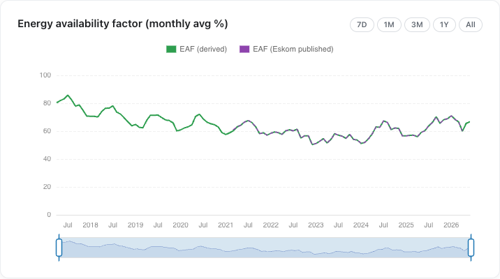
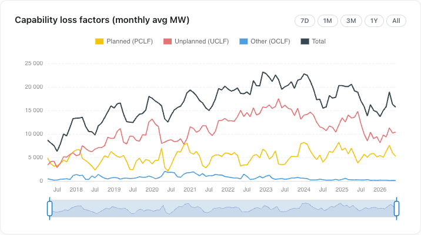
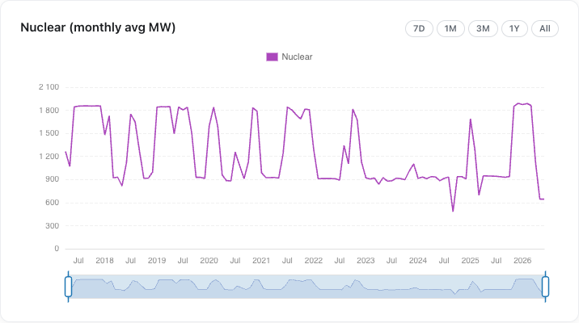
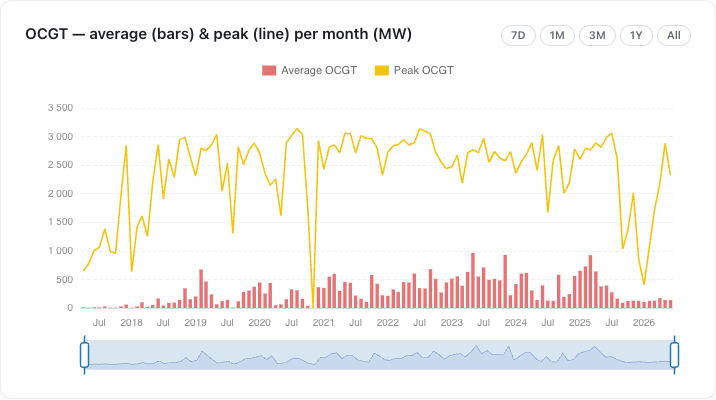
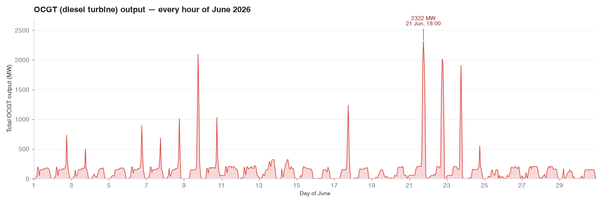
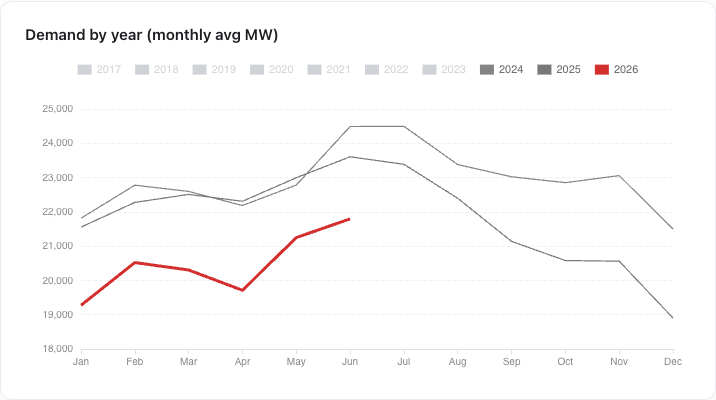
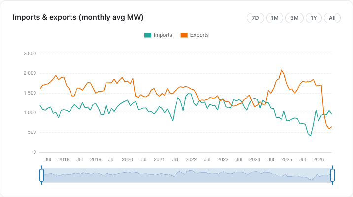
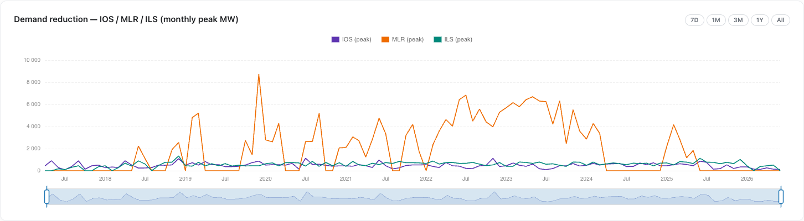

{/*
NOTES FOR GARETH (not rendered):
- All figures from the refreshed warehouse (June 2026 complete; July excluded).
- Chart images are live screenshots from the Long-term tab (re-shoot if data updates).
- Official EAF for June not yet published by Eskom at time of writing — omitted.
*/}

June extends May's shallow recovery by another notch — but the same cracks are all still there. The fleet is a little more available, mostly because winter maintenance is winding down and demand keeps falling. Koeberg is now into its second full month running a unit at reduced capacity with no public word, and June demand was the lowest on record for the month.

June 2026 saw:

- **EAF edge up to 66.8%** (from 65.5% in May), and ~6.5 points better than June 2025
- **Nuclear stuck at 645 MW** — a second consecutive month with a Koeberg unit crippled, still unexplained
- **Demand fall to 21,795 MW — the lowest June on record**, below even Covid-2020
- **Exports stuck at the floor** (652 MW), still less than half of imports
- **Demand-reduction tools stood down** — ILS peaked at zero for the first time in months

{/* truncate */}

---

## Outages: the seasonal easing continues

The Energy Availability Factor rose again, from May's 65.5% to **66.8%** — the third straight month of improvement off April's 60.1% low. As in May, most of this is seasonal: planned maintenance (PCLF) fell from 12.7% to **11.0%** as Eskom finishes prepping the fleet for winter peak. Total outages eased from 16,311 MW to **15,697 MW** of capacity.

The year-on-year picture is the real good news. June 2025 sat at 60.3% EAF with unplanned outages (UCLF) at a brutal 31.2%; this June, UCLF is down to **22.0%** — roughly 4.4 GW less unplanned breakage than a year ago. The fleet is meaningfully less broken than it was, even if it's still a long way from healthy.

*EAF climbs for a third month to 66.8%, tracking the seasonal maintenance wind-down.*

*Total outages (black) eased to ~15.7 GW as planned maintenance (yellow) came off; unplanned (red) is well below its June-2025 level.*

---

## Koeberg still broken — now for a second month

The one number that hasn't moved is the one Eskom won't discuss. Nuclear output averaged **644.5 MW** in June — statistically identical to May's 645 MW, and roughly a third below the ~1,870 MW the station ran in January–March. This is now a **second full month** of a Koeberg unit running at heavily reduced capacity, the same fault first visible in April (1,129 MW), with still no public explanation.

A flagship nuclear station losing a unit's worth of output for two months running, silently, is not a footnote. It's ~1.2 GW of the cheapest baseload on the grid quietly missing while Eskom talks up its winter readiness.

*Nuclear falls off a cliff in April and stays pinned at ~645 MW through May and June — one unit well below its rating, two months and counting.*

---

## OCGT: cheap on average, but the evening peaks are still expensive

On a monthly average OCGT (diesel turbine) use looks trivial — **138 MW**, flat on May and a third of June 2025's 394 MW. But the average buries the story. The monthly *peak* was **2,322 MW**: down from May's 2,879 MW, but the second-highest of 2026 and well above April's 2,180 MW. Diesel-peak use has climbed steadily through autumn into winter (March 1.7 GW → April 2.2 GW → May 2.9 GW → June 2.3 GW), not fallen away.

That peak has a very specific shape. Averaged across the month, OCGT output is near-zero overnight and through the middle of the day, then jumps to a mean of **586 MW at 18:00** — the single busiest hour, more than 3× any daytime hour. The fleet is being fired almost entirely to get through the 6pm evening peak, when demand spikes and solar has dropped off. The monthly maximum of 2,322 MW landed at exactly **18:00 on 21 June**, and every one of the ten biggest OCGT hours in June fell between 17:00 and 19:00.

It wasn't an everyday event: **12 of June's 30 days** saw an evening OCGT burst above 500 MW, **7 days** above 1 GW, and just **3 days** above 2 GW — clustered in a cold snap around **21–23 June**. So the picture is a fleet that coasts most of the month, then leans hard on the most expensive plant it owns for a handful of winter evenings.

*Average OCGT use (red bars) stays minimal; the monthly peak (yellow line) eases from May but holds well above the summer months.*

*Every hour of June. Output is near-zero most of the time, spiking into sharp evening peaks — biggest during the 21–23 June cold snap, topping out at 2,322 MW at 6pm on the 21st.*

---

## Demand at a record low — again

The recovery keeps being underwritten by shrinking demand. Average residual demand in June was **21,795 MW** — the lowest June figure in the record, below June 2020 (24,718 MW) at the height of Covid, and down ~7.7% on June 2025 (23,606 MW).

June demand is normally higher than May's as winter heating load comes on, and it was (21,795 vs 21,249). But even with that seasonal lift, it still undercut every prior June on the board. Rooftop solar, industrial load curtailment and a flat economy keep eating grid demand — which is a big part of why the "surplus" looks as comfortable as it does.

*June 2026 (red) sits below every prior year — the lowest June demand on record.*

---

## Exports still stuck at the floor

The trade-side story from April and May didn't change: exports stayed depressed at **652 MW**, less than half the 1,728 MW of June 2025 and still below imports (**962 MW**). The collapse in exports that first appeared in April has now held for three months straight — no longer a blip, but a settled lower level, and a sign that demand across the region remains weak.

*Exports (orange) remain pinned near the bottom of their range and below imports (green) — the depressed level first seen in April held through June.*

---

## Demand-reduction tools stood down

For the first time in months, Eskom barely touched its demand-reduction levers. Interruptible load (ILS) peaked at **zero** in June — down from 507 MW in May and 1,124 MW in June 2025 — and Instantaneous Operating reserves (IOS) peaked at just 116 MW. Manual load reduction (MLR) has been dormant since 2024. On the demand-reduction side, at least, June genuinely looks like a comfortable month.

*Monthly peak demand reduction. ILS (teal) drops to zero for the first time in months; MLR (orange) remains near zero.*

---

## Outlook

June continued the trend of the last two months: a slowly-healing fleet, a quiet winter so far, and demand-reduction tools that Eskom didn't need to pull. That's real progress on unplanned outages year-on-year, and the low diesel burn is a genuine positive.

But the caveats haven't gone anywhere. The improvement is still half a demand-collapse story — the lowest June demand ever recorded — and Koeberg is now two months into an unexplained reduced-output run. The grid is more comfortable than it was a year ago, but "comfortable because demand keeps falling and nobody's asking about the nuclear unit" is not the same as "fixed."

---

*Data and charts from [unofficialeskom.com](https://unofficialeskom.com). Corrections and questions welcome.*
