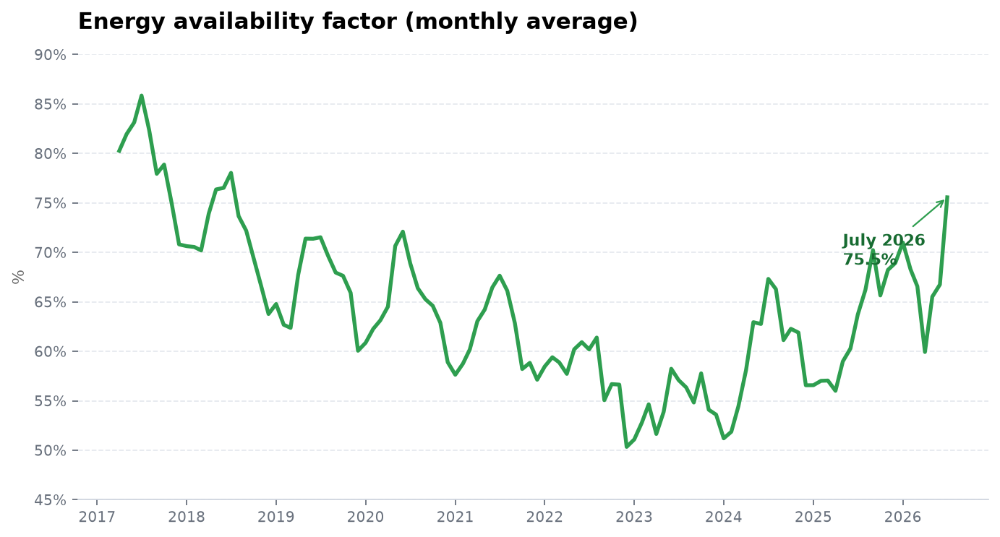
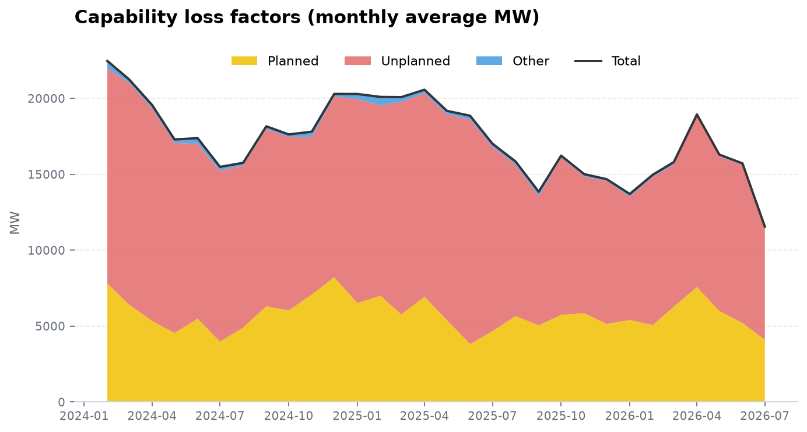
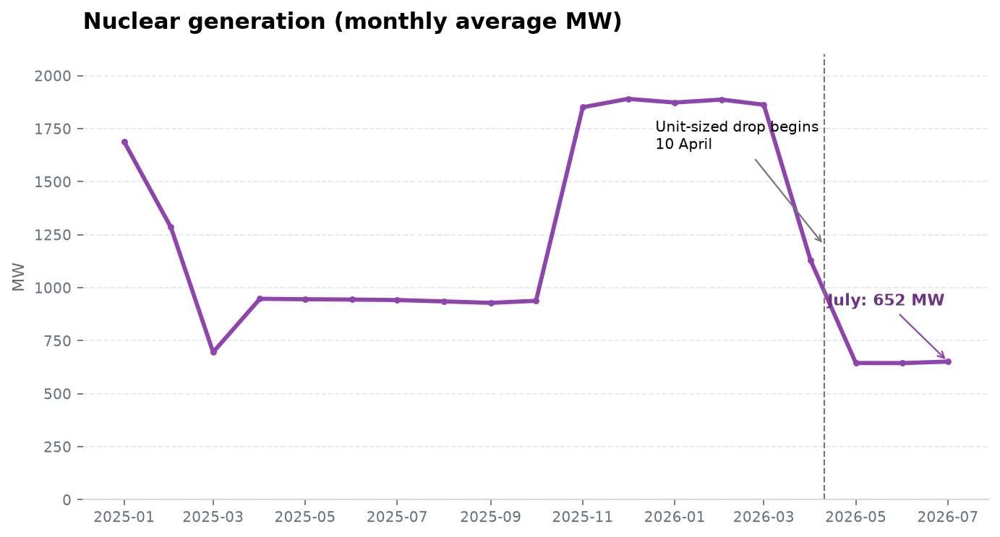
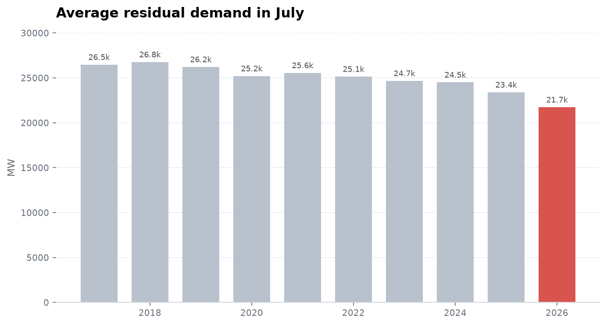
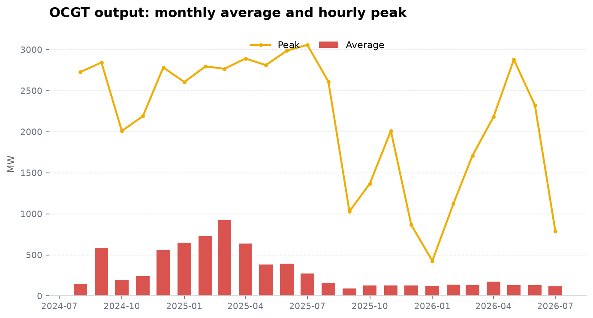
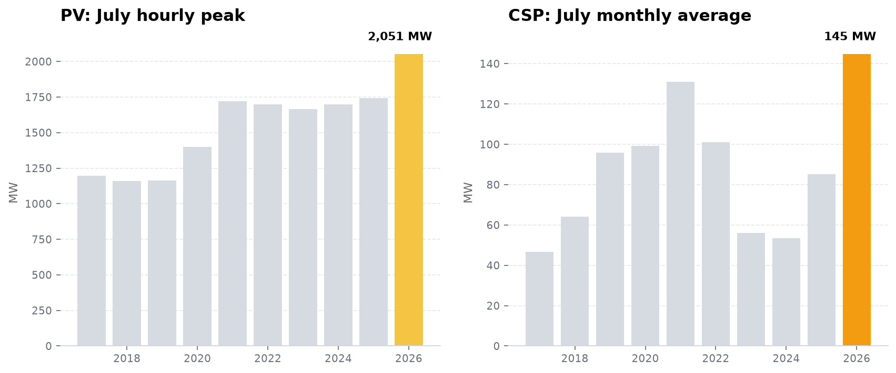

July delivered the strongest fleet-availability numbers in eight years. The Energy Availability Factor jumped to 75.6%, unplanned outages fell by 3 GW in a month, and Eskom kept diesel generation unusually low through the middle of winter.

The improvement came with two large qualifications. Nuclear generation remained stuck near 650 MW for a third full month, and average demand fell to the lowest July in the data. Solar also set a pair of seasonal records, although weak wind meant renewables as a whole did not break a record.

July 2026 saw:

- **EAF jump to 75.6%**, its highest monthly average since July 2018
- **Total outages fall by 4.2 GW** from June, to 11.6 GW
- **Nuclear remain near 652 MW**, after the station's output first dropped on 10 April and fell again on 25 April
- **Demand fall to 21,726 MW, the lowest July on record**
- **PV and CSP set new July records**, while weak wind pulled total renewable generation below July 2025
- **OCGT output peak at only 790 MW**, down from 2,322 MW in June

{/* truncate */}

---

## EAF reached its highest level since 2018

The derived Energy Availability Factor rose from 66.7% in June to **75.6% in July**, an 8.8-point improvement in one month. July 2025 averaged 63.7%, putting this July almost 12 points ahead year on year. The last stronger month in the bulk record was July 2018 at 78.0%.

Both planned and unplanned outages improved. Planned losses fell from 5.2 GW to **4.1 GW**, while unplanned losses dropped from 10.4 GW to **7.4 GW**. Other capability losses were negligible. Together, the three categories averaged **11.6 GW**, down from 15.7 GW in June and their lowest monthly level since July 2018.

*EAF rose sharply to 75.6% in July, its best monthly result since July 2018.*

*Total capability losses fell by 4.2 GW in one month as both planned and unplanned outages eased.*

This is more than the normal winter maintenance wind-down. Planned maintenance did fall, as expected, but the larger contribution came from unplanned outages. UCLF moved from 22.0% of installed capacity in June to **15.7% in July**, also its best result since July 2018.

## Koeberg remained near 650 MW for a third full month

The recovery in the rest of the fleet did not include Koeberg. Nuclear output averaged **652 MW in July**, barely changed from 644 MW in June and 645 MW in May. January through March averaged roughly 1,875 MW.

The hourly bulk data shows two distinct steps in the decline. Nuclear generation was still near 1.8 GW on 9 April. It fell to roughly 900 MW on **10 April**, consistent with losing one unit's output, then dropped again to about 620 MW on **25 April**. Output recovered slightly into the 650 MW range during May but stayed there through the end of July.

By 31 July, the initial unit-sized loss had lasted 112 days. The lower-output plateau that began on 25 April had lasted 97 days. July was the third complete month with Koeberg producing only about one-third of the output seen in the first quarter.

*Nuclear output collapsed in April and remained near 650 MW through May, June, and July.*

The contrast with the fleet-wide numbers is striking: Eskom produced its best EAF since 2018 while roughly 1.2 GW of nuclear output remained missing. Coal availability had to improve enough to offset that loss.

## Demand set another record low

Average residual demand was **21,726 MW**, the lowest July in the record. That is 7.1% below July 2025 and 13.8% below July 2020, when Covid restrictions were still affecting the economy.

*July 2026 demand fell below every previous July, continuing the record-low monthly demand seen in May and June.*

This makes the supply-side improvement easier to sustain. Lower demand does not create a higher EAF, because EAF measures fleet availability rather than electricity consumption, but it reduces the consequences of an outage and the need to run expensive peaking generation. July combined both: the fleet was genuinely more available, and it had less load to serve than in any previous July.

## Diesel use fell despite the winter peak

Open-cycle gas turbine output averaged **116 MW** in July, down from 134 MW in June. The more surprising number was the monthly peak: only **790 MW**, reached at 18:00 on 13 July. June peaked at 2,322 MW, and May at 2,879 MW.

*July's OCGT peak stayed below 800 MW, a sharp break from the multi-gigawatt evening peaks in May and June.*

Interruptible load shedding did briefly return. ILS reached **820 MW at 18:00 on 7 July**, after peaking at zero in June. It was an isolated event: the next-highest July hour was only 67 MW, and the monthly average was 1.2 MW. Manual load reduction remained at zero.

International trade remained weak. Exports recovered slightly from 652 MW in June to **722 MW**, but still sat below imports of **1,090 MW** and were 60% lower than July 2025.

## Solar set July records, but renewables overall did not

The renewable-record hunch is correct for solar, with an important limit: these are **July records**, not all-time records.

PV output reached **2,051 MW at 13:00 on 24 July**, beating the previous July high of 1,741 MW from 2025 by 18%. Concentrated solar power averaged **145 MW** across the month, ahead of the previous July record of 131 MW in 2021. CSP also reached a new July hourly peak of **535 MW** on 31 July.

*PV set a new July hourly peak, while CSP recorded its highest July monthly average.*

Total renewable output did not set a record. Wind averaged **1,030 MW**, well below the 1,532 MW recorded in July 2025. Combined wind, PV, CSP, and other renewable generation averaged **1,642 MW**, down 22% year on year. The new solar highs partly offset a poor wind month, but not enough to lift the combined total.

## Outlook

July is the strongest month in the recent recovery. A near-12-point year-on-year EAF improvement, 3 GW less unplanned capacity offline, and an OCGT peak below 800 MW are meaningful gains. Unlike some previous good months, this was not only planned maintenance moving around.

The low-demand caveat remains, and Koeberg is now the clearest unresolved weakness in the data. The grid carried winter comfortably while nuclear output stayed near 650 MW, but doing so required better performance from the rest of the fleet and another record-low month for demand. Solar's July records helped during daylight hours; weak wind and the persistent nuclear shortfall kept the generation picture less complete than the headline EAF suggests.

---

*Data and charts from the Eskom bulk export, analyzed by [unofficialeskom.com](https://unofficialeskom.com). Corrections and questions welcome.*
