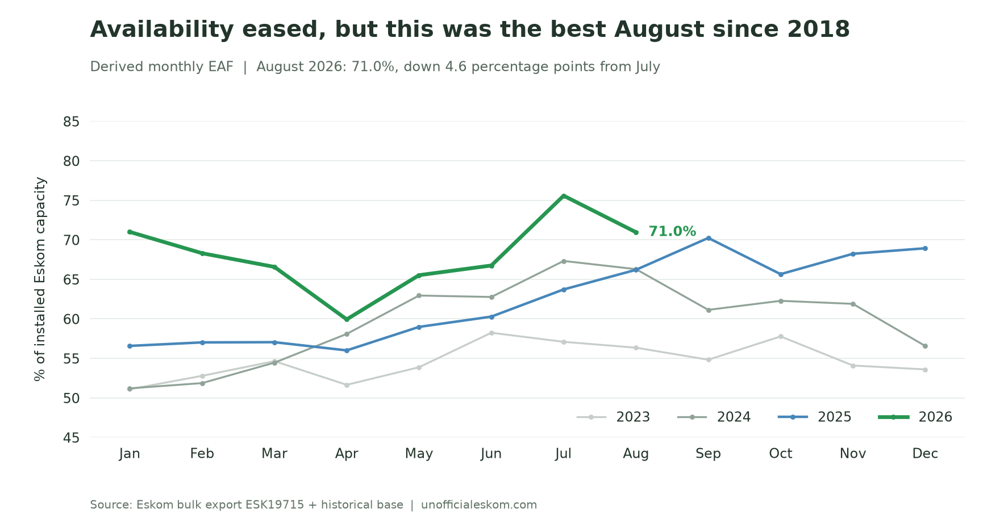
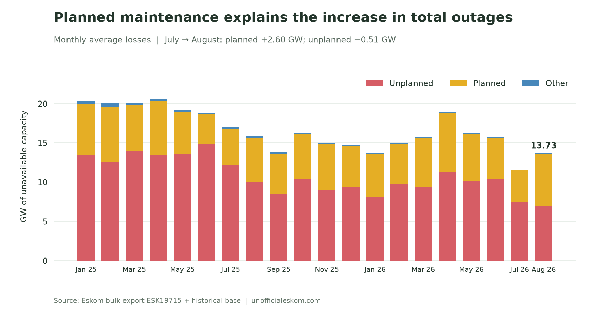
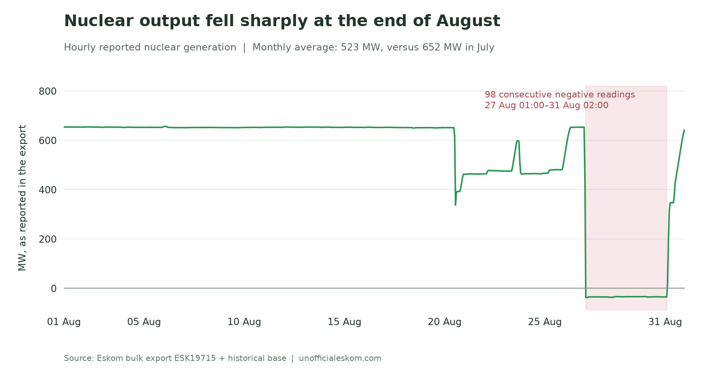
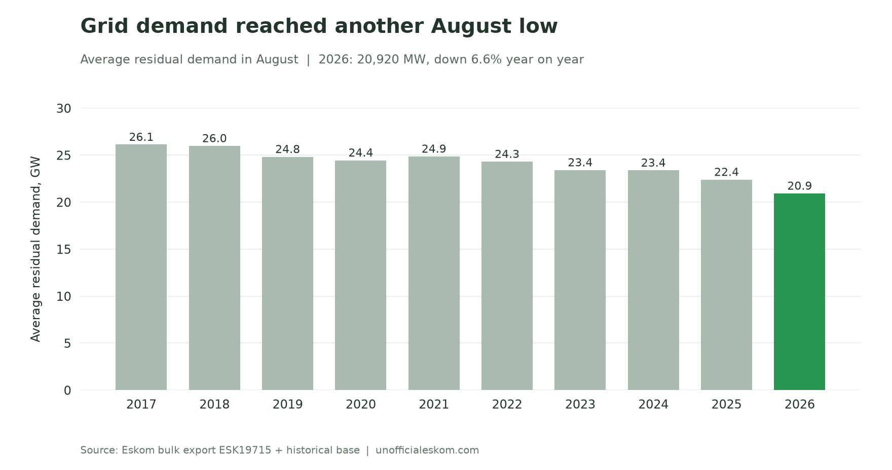
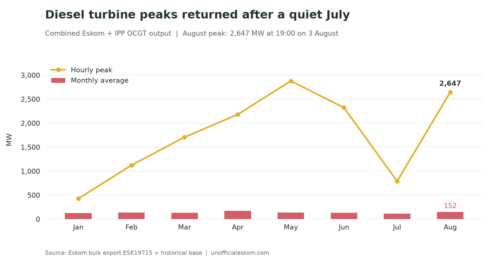
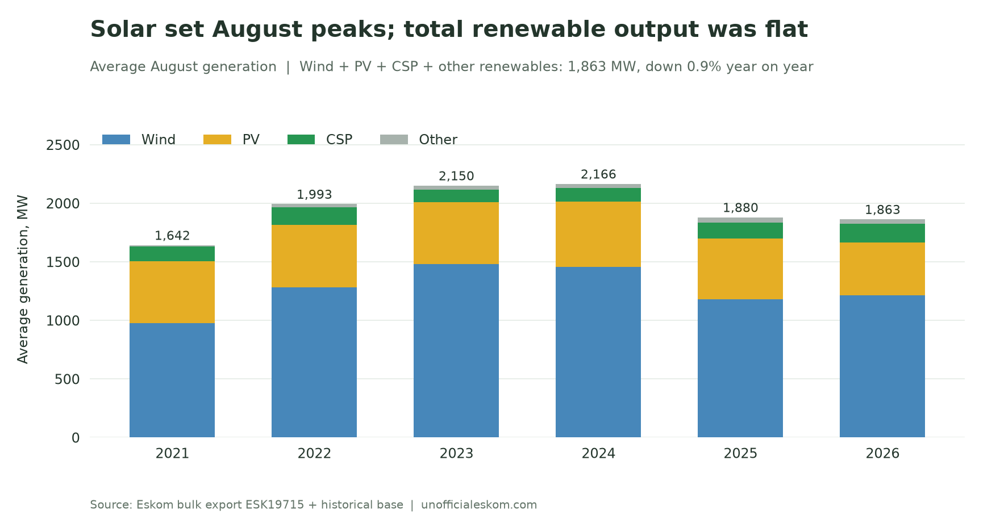

July's jump in availability did not last. Eskom's derived Energy Availability Factor fell to **71.0% in August**, from 75.6% in July, as planned maintenance returned. But unplanned outages improved again: the headline decline came from more scheduled capacity offline, with a smaller contribution from other losses.

The sharper deterioration was in nuclear generation. After three months near 650 MW, average output fell to **523 MW**, with a sustained run of negative reported readings at the end of August. Demand also fell, reaching the lowest August average in the bulk record.

August 2026 saw:

- **EAF fall 4.6 percentage points**, while remaining the strongest August since 2018
- **Planned outages rise by 2.6 GW**, offsetting another 0.5 GW improvement in unplanned outages
- **Nuclear output average 523 MW**, with 98 consecutive negative hourly readings late in the month
- **Residual demand average 20,920 MW**, down 6.6% year on year
- **OCGT output peak at 2,647 MW**, more than three times July's peak
- **PV and CSP set August hourly records**, although total renewable generation remained slightly below August 2025

{/* truncate */}

## Maintenance pulled EAF back down

August's **71.0% EAF** was 4.6 points below July, but 4.8 points above August 2025. The last stronger August in this record was 2018, at 73.7%.

*Availability eased from July's high but remained ahead of the previous three Augusts shown here.*

The outage breakdown explains the change. Planned losses rose from **4.09 GW to 6.69 GW**, an increase of 2.60 GW. Unplanned losses moved the other way, falling from **7.41 GW to 6.90 GW**. Other losses increased from 39 MW to 135 MW.

Together, outages averaged **13.73 GW**, up from 11.55 GW in July. Planned maintenance accounted for more than the entire net increase; the improvement in unplanned outages offset part of it.

*The planned-maintenance increase outweighed the further reduction in unplanned losses.*

Unplanned losses were also **3.08 GW below August 2025**. As a share of installed capacity, UCLF fell to 14.6%, from July's 15.7%. That matters when interpreting the lower EAF: August still showed progress in the unplanned-outage measure.

## Nuclear generation dropped sharply at month-end

Nuclear output averaged **523 MW**, down 20% from July's 652 MW and 44% from August 2025. It was the lowest August nuclear average in the record, which starts in 2017.

The hourly detail is more revealing than the monthly average. Output stayed close to 650 MW through 19 August, then fell into a lower, more variable range. It briefly returned to around 650 MW on 26 August before dropping sharply again.

From **01:00 on 27 August through 02:00 on 31 August**, the export reports **98 consecutive negative hourly readings**, generally around −35 MW. Positive readings resumed at 03:00 on 31 August, and output reached about 640 MW that evening.

*The late-month decline reduced the monthly average even though output had stayed near 650 MW for most of August.*

Eskom explained the initial reduction in its [21 August update](https://x.com/Eskom_SA/status/2090770499613671431?s=20): marine material had built up at the seawater intake, causing a cooling pump to switch off automatically. Unit 1 was reduced to 50% power as a precaution, while Unit 2 was already offline for planned maintenance.

In its [31 August update](https://x.com/Eskom_SA/status/2094306306756604382?s=20), Eskom said Unit 1 had subsequently been taken offline following a turbine trip and returned to service at **03:00 that morning**. That return time matches the first positive reading in the export. Eskom said nuclear safety was maintained throughout.

The chart and monthly average preserve the signed values as published. Nuclear output remained below its early-August level at month-end, despite the return to service.

## Demand set another August low

Average residual demand fell to **20,920 MW**, 3.7% below July and 6.6% below August 2025. This was the lowest August in the 2017–2026 bulk record, and 14.4% below August 2020.

*August demand has fallen from 26.1 GW in 2017 to 20.9 GW in 2026.*

Lower grid demand gives the system more room to absorb lost generation. It does not itself increase EAF, which measures the availability of Eskom's installed fleet. Nor does this residual-demand series alone tell us how much of the decline comes from private generation, changing electricity use or other factors.

## Diesel peaks returned

Combined Eskom and IPP open-cycle gas turbine output averaged **152 MW**, up from July's 116 MW but still slightly below August 2025's 160 MW.

The larger change was in peak use. OCGT output reached **2,647 MW at 19:00 on 3 August**, compared with July's maximum of 790 MW. Another pair of hours exceeded 2 GW on 31 August. The ten largest OCGT readings of the month all fell between 18:00 and 20:00.

*August's average remained modest, but the evening peaks returned to multi-gigawatt levels.*

Interruptible load use remained limited: ILS peaked at **447 MW**, below July's isolated 820 MW event, and averaged less than 1 MW. The export's manual load reduction field remained at zero throughout August.

## Solar peaks improved; monthly renewable output barely changed

PV reached **2,117 MW at 11:00 on 28 August**, beating the previous August hourly record of 1,943 MW by 8.9%. CSP also set an August peak, reaching **539 MW at 16:00 on 23 August**, compared with the previous high of 500 MW.

Those peaks did not translate into a record month for total renewable generation. PV's monthly average was **455 MW**, down 12.2% year on year. Wind averaged **1,211 MW**, up 2.8%, while CSP averaged **158 MW**, up 12.9%.

Combined wind, PV, CSP and other renewable output averaged **1,863 MW**. That recovered 13.4% from July's weak result but remained 0.9% below August 2025 and below the stronger August totals of 2022–2024.

*New PV and CSP hourly peaks coexisted with a slightly lower combined monthly average than a year earlier.*

Electricity trade also remained below its earlier export levels. Exports averaged **822 MW**, up from July's 722 MW but still 54% below August 2025. Imports averaged **1,223 MW**, leaving net imports of about 402 MW.

## What August tells us

The lower EAF needs to be read alongside the continued improvement in unplanned outages. Planned maintenance increased substantially, but August still delivered the best availability for that calendar month since 2018. That is a stronger result than the month-on-month headline alone suggests.

Nuclear generation is the clearest concern in this month's hourly data. Its contribution was already much lower than in the first quarter, and August brought a further late-month decline. Lower demand helped the system accommodate that loss, while diesel turbines supplied several large evening peaks. The rest of the fleet's availability improved year on year, but the nuclear recovery remained incomplete at month-end.

---

*Method: monthly means calculated from the Eskom bulk export `ESK19715.csv`, merged with the historical base covering April 2017 onward. All 744 August hours have values for the metrics discussed. EAF is derived hourly as 100 × (1 − (PCLF + UCLF + OCLF) / installed Eskom capacity), then averaged; it is not Eskom's separately published official monthly EAF. Times follow the export's hour labels. Historical comparisons use the latest merged export, which can revise figures in earlier posts. “August records” refer only to August observations in this dataset. Charts and analysis by [unofficialeskom.com](https://unofficialeskom.com).*
