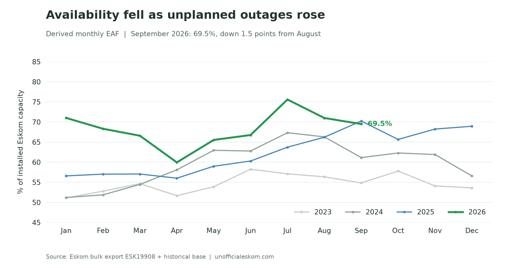
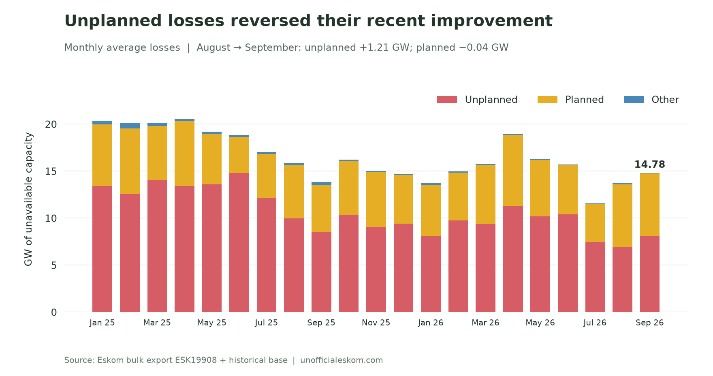
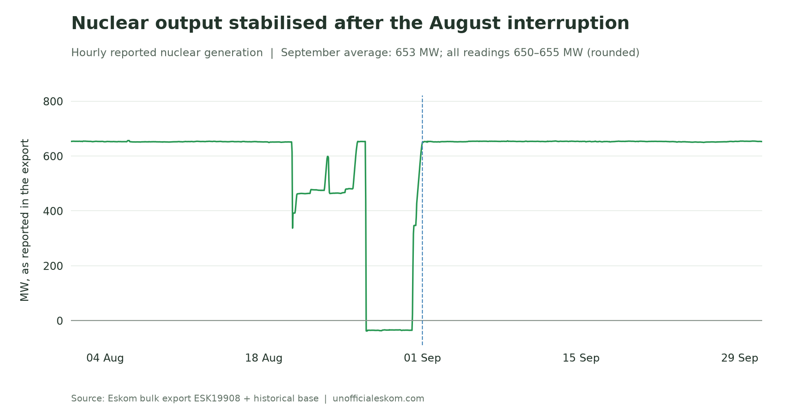
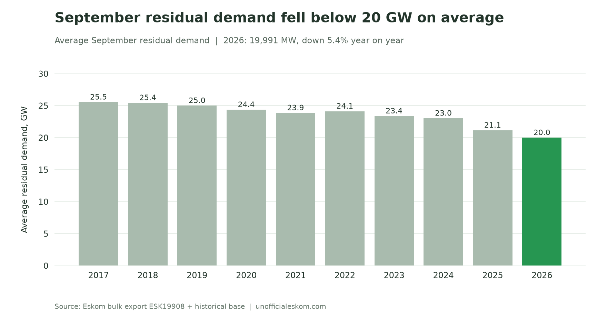
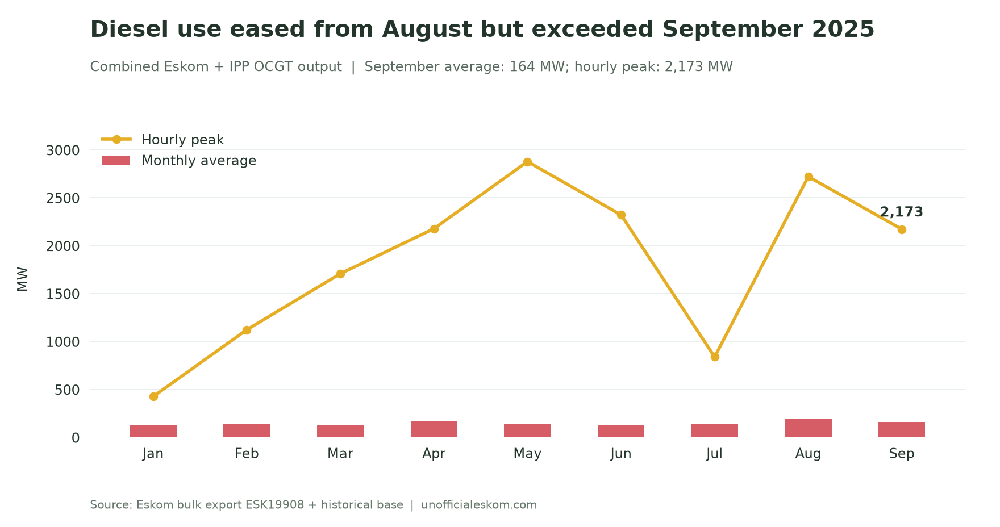
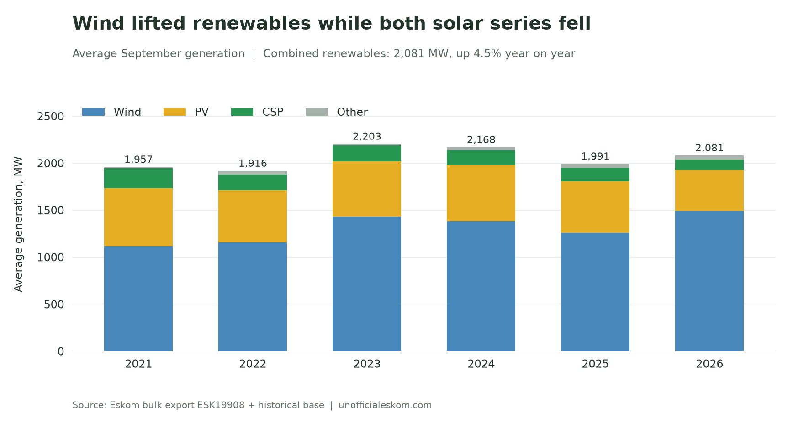

Eskom's derived Energy Availability Factor fell again in September, to **69.5%**. Unlike August, when increased planned maintenance explained the decline, September brought a rise in unplanned outages. Planned losses barely changed.

There was better news from nuclear generation: output recovered from August's interruption and stayed close to **653 MW throughout September**. Average residual demand fell below 20 GW, while stronger wind generation lifted renewable output despite weaker solar generation.

September 2026 saw:

- **EAF fall 1.5 percentage points** from August and 0.8 points from September 2025
- **Unplanned losses rise by 1.21 GW**, to 8.10 GW
- **Nuclear generation average 653 MW**, up 24.8% from August
- **Residual demand average 19,991 MW**, the lowest September in the bulk record
- **Combined OCGT output average 164 MW**, down from August but 79.3% above September 2025
- **Wind generation rise 18.3% year on year**, offsetting declines in PV and CSP

{/* truncate */}

## Unplanned outages pulled availability lower

September's **69.5% derived EAF** was below August's 71.0% and September 2025's 70.2%. It remained well above the September results of 2021–2024, which ranged from 54.8% to 62.9%.

*Availability fell for a second month after July's high.*

Unplanned losses increased from **6.89 GW in August to 8.10 GW in September**. Planned losses eased slightly, from 6.69 GW to 6.65 GW, while other losses fell from 135 MW to 28 MW. Total losses therefore rose from **13.72 GW to 14.78 GW**.

*The September increase came from unplanned outages, with planned maintenance almost unchanged.*

The year-on-year picture was more mixed. Unplanned losses remained **416 MW below September 2025**, but planned losses were 1.60 GW higher. Lower other losses offset another 257 MW of that increase.

There is also a change in the denominator. The export reports **48,436 MW of installed Eskom capacity** for every September hour, up from 47,276 MW in August. Using August's capacity with September's reported losses would give an EAF of about **68.7%**, rather than 69.5%. The larger reported fleet therefore cushions the decline in the derived percentage. The bulk file alone does not establish why installed capacity changed.

## Nuclear output recovered and stayed steady

September nuclear generation averaged **653 MW**, up 24.8% from August's 523 MW. Every hourly reading was positive, within a narrow **649.6–655.0 MW** range. August's prolonged negative readings did not recur.

*September restored the steady output seen before August's interruption.*

This was a recovery to the roughly 650 MW level seen in June and July. It still left nuclear output **29.7% below September 2025's 929 MW average**. Stability improved, but the monthly contribution remained substantially below last year's.

## Demand reached a new September low

Average residual demand was **19,991 MW**, down 4.6% from August and 5.4% from September 2025. This was the lowest September average in the record, which begins in April 2017. September 2017 averaged 25,546 MW: the decline since then is 21.7%.

*Average demand fell below 20 GW, although individual hours remained much higher.*

The month's demand peak was **27,837 MW at 18:00 on 7 September**. That was also the hour with the highest combined OCGT generation. Monthly averages describe the overall energy requirement; the evening peak still needed additional supply.

Lower residual demand gives the system more room to accommodate unavailable generation. This series alone does not identify how much of the decline reflects private generation, changing electricity use or other causes.

## Diesel use fell from August but rose year on year

Combined Eskom and IPP open-cycle gas turbine generation averaged **164 MW**, down 15.4% from August's revised 194 MW. It was nevertheless 79.3% above September 2025's 91 MW average. September's combined OCGT energy total was **118.1 GWh**.

*September's diesel use eased from August, but remained above the same month last year.*

The peak reached **2,173 MW at 18:00 on 7 September**. Five hours exceeded 1 GW, all at 18:00 or 19:00, on 7, 9 and 20 September. The peak was lower than August's 2,647 MW.

Both ILS usage and the export's manual load reduction field were zero throughout September. These fields do not measure every form of local electricity interruption.

## Wind offset weaker solar generation

Wind generation averaged **1,490 MW**, up 18.3% year on year and 23.1% from August. PV moved the other way, averaging **438 MW**, down 19.5% year on year. CSP averaged **108 MW**, down 26.7%.

*Wind more than offset the declines in PV and CSP.*

Combined wind, PV, CSP and other renewable output averaged **2,081 MW**, up 4.5% from September 2025 and 11.7% from August. It remained below the September totals of 2023 and 2024.

Wind's hourly maximum reached **3,460 MW**, exceeding the previous September high of 3,164 MW. PV also set a September hourly high, at **2,063 MW**, despite its lower monthly average. CSP's 463 MW peak remained below earlier September highs.

Electricity trade narrowed to a small net import position. Imports averaged **826 MW** and exports 738 MW, leaving net imports of 88 MW, compared with 402 MW in August. September 2025 had instead averaged net exports of 1,324 MW.

The main deterioration in September was the return of higher unplanned losses. Nuclear stability, stronger wind and lower residual demand helped the supply picture, but none of those changes reverses the increase in unavailable capacity.

---

*Method: hourly data from Eskom bulk export `ESK19908.csv`, merged with the historical base covering April 2017 onward. All 720 September hours have values for the metrics discussed. EAF is calculated hourly as 100 × (1 − (PCLF + UCLF + OCLF) / installed Eskom capacity), then averaged; it is not Eskom's separately published official monthly EAF. All comparisons use this latest merged export. Eskom revised August residual demand from 20,920 MW in the previous export to 20,963 MW, and combined OCGT generation from 152 MW to 194 MW; comparisons here use the revised values. Times follow the source hour labels. “September records” mean September observations in this dataset, and renewable figures cover the export's wind, PV, CSP and other RE series, without adding a separate rooftop-PV estimate. Charts and analysis by [unofficialeskom.com](https://unofficialeskom.com).*
